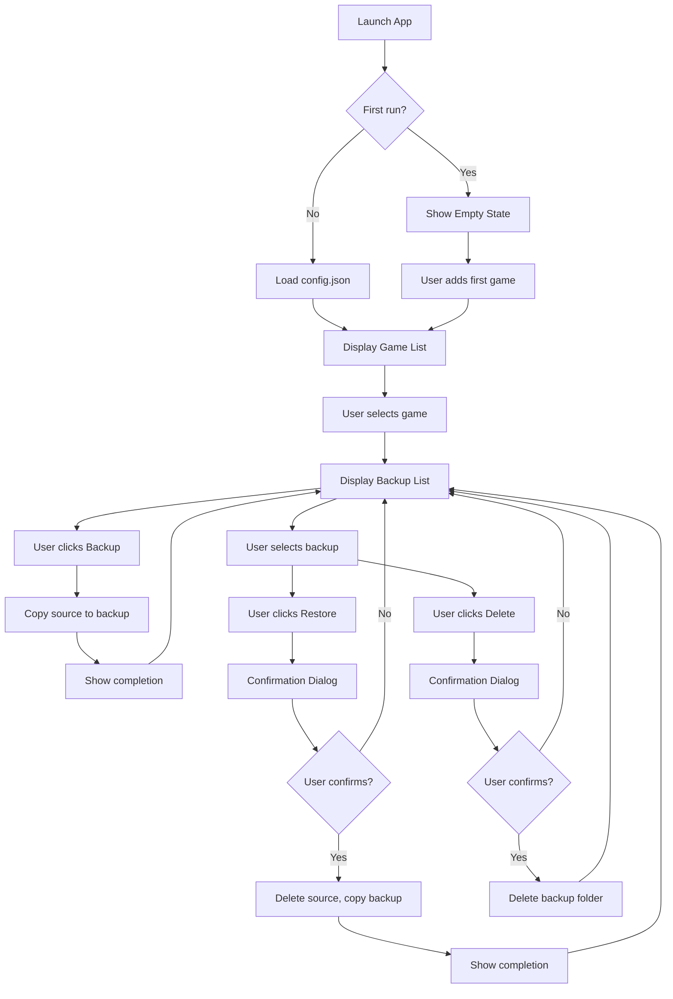

# Backup Manager

## DNA (Document Metadata)

| Field | Value |
|-------|-------|
| **Project** | backup-manager |
| **Status** | Draft |
| **Author** | Owner |
| **Date** | 2026-05-02 |
| **Stakeholders** | - |
| **Version** | 1.0 |

---

## 1. Problem Statement

PC game saves are fragile. A bad update, a corrupted file, or an accidental overwrite can wipe hours of progress. The existing solutions are:

- **Manual copy-paste** — error-prone, easy to forget, hard to organize
- **PowerShell scripts** — functional but inaccessible to non-technical users
- **Cloud sync (Steam Cloud, etc.)** — not available for all games, not user-controlled

There is no simple, game-agnostic desktop tool that a non-technical user can download and use in under a minute.

**The app must allow any user to back up and restore game saves without opening a terminal.**

---

## 2. Context & Background

The project originated as a pair of PowerShell scripts (`backup_zomboid.ps1` / `restore_zomboid.ps1`) built for Project Zomboid. The app generalizes that logic into a reusable, friendly tool that works for **any game** on Windows.

### Tech Stack (from AGENT.md)

| Layer | Choice | Reason |
| :---- | :---- | :---- |
| Language | Python 3.11+ | Cross-skill, easy packaging with PyInstaller, stdlib covers most needs |
| UI Framework | CustomTkinter | Modern look on top of Tkinter, no external DLLs, ships inside .exe |
| Packaging | PyInstaller | Produces a single .exe, no Python install required |
| Config storage | JSON (stdlib) | No database, human-readable, portable |
| File ops | shutil + pathlib (stdlib) | No extra dependencies |
| Unique IDs | uuid (stdlib) | Game entries need stable IDs |
| Tests | pytest | Standard, simple, widely supported |

### Architecture (from AGENT.md)

- **core/** — Zero UI code. All file system operations, config reads/writes, business logic.
- **ui/** — Consumes core/, but never the reverse. Makes core/ fully testable without a display.
- **Threading** — Backup/restore operations run in background thread. UI never blocks.
- **No global state** — App class holds all state. core/ functions are stateless.

---

## 3. Goals & Success Metrics

### Primary Goal

Enable any non-technical user to back up and restore PC game saves with a single click, no terminal required.

### Success Metrics

| Metric | Current | Target | How to Measure |
|--------|---------|--------|----------------|
| Time to first backup | Manual copy-paste (~5 min) | < 30 seconds | User performs first backup |
| Restore success rate | ~80% (manual errors) | 100% | Automated test + user feedback |
| Distribution size | - | < 25 MB | PyInstaller output |
| Startup time | - | < 3 seconds | User perception |

---

## 4. Target Users

### Primary User
- **Role**: PC gamer with little or no technical background
- **Need**: Back up game progress without remembering to do it manually or learning commands
- **Frequency**: Weekly or after important milestones
- **Context**: At home, after gaming sessions

### Secondary Users
- **Power users** — Who want a faster, GUI-based alternative to running scripts manually

---

## 5. User Stories

### US-01: Add Game
**As a** user
**I want** to register a game with its save location and backup destination
**So that** I can manage backups for that game

**Acceptance Criteria:**
- [ ] User enters a display name (e.g., "Project Zomboid")
- [ ] User selects source path via OS file picker (no manual typing)
- [ ] User selects backup destination via OS file picker
- [ ] Game is saved to config.json
- [ ] Game appears in the game list immediately

### US-02: Create Backup
**As a** user
**I want** to back up my game save with one click
**So that** I don't lose progress if something goes wrong

**Acceptance Criteria:**
- [ ] User selects a game from the list
- [ ] User clicks "Backup" button
- [ ] App copies source folder to backup path with timestamp suffix (format: `<name>-YYYYMMDD_HHmmss`)
- [ ] Progress is visible during copy (progress bar or status text)
- [ ] Completion shows: start time, end time, duration, size
- [ ] Backup appears in the list immediately

### US-03: Restore Backup
**As a** user
**I want** to restore a previous backup
**So that** I can recover from a bad update or corrupted save

**Acceptance Criteria:**
- [ ] User selects a game
- [ ] User selects a backup from the list
- [ ] User clicks "Restore"
- [ ] Confirmation dialog shows what will be affected
- [ ] User confirms
- [ ] App deletes current source folder, copies backup to its place
- [ ] Completion shows duration and size
- [ ] **Cancel leaves source folder untouched**

### US-04: Delete Backup
**As a** user
**I want** to remove old backups to free up space
**So that** I don't accumulate too many backups

**Acceptance Criteria:**
- [ ] User selects one or more backups
- [ ] User clicks "Delete"
- [ ] Confirmation dialog is shown
- [ ] User confirms
- [ ] Backup folder is removed from disk
- [ ] Backup disappears from list immediately

### US-05: Settings - Manage Games
**As a** user
**I want** to add, edit, or remove games
**So that** I can keep my game list up to date

**Acceptance Criteria:**
- [ ] Settings screen accessible from main window
- [ ] User can add new game
- [ ] User can edit existing game (name, paths)
- [ ] User can delete game (does NOT delete backups from disk)
- [ ] Configuration persists across restarts

---

## 6. Functional Requirements

### FR-01: Game Configuration
The user registers one or more games. Each game has:
- Display name (e.g., "Project Zomboid — ARK server")
- Source path: the folder that contains the active save
- Backup path: where backups for this game will be stored

**Details:**
- Paths selected via OS native file picker
- config.json persisted next to executable

### FR-02: Backup Operation
For a selected game, copy source folder to backup path.

**Details:**
- Backup folder format: `<original_folder_name>-YYYYMMDD_HHmmss`
- After copy: show start time, end time, duration, size

### FR-03: Restore Operation
Replace current source folder with selected backup.

**Details:**
- 1. Delete current active save folder
- 2. Copy selected backup into its place
- 3. Show completion summary (duration, size)

⚠ **Destructive — confirmation dialog REQUIRED before any files are deleted.**

### FR-04: Backup List
Display all backups for the selected game, sorted newest first.

**Details:**
- Each row shows: name, date, size
- Updates after every backup or delete operation

### FR-05: Delete Old Backups
Select and remove one or more backups.

**Details:**
- Confirmation dialog required
- Bulk delete supported

### FR-06: Settings Screen
Manage games and configuration.

**Details:**
- Add/edit/remove games
- Change backup destination per game
- Show config.json location

---

## 7. Non-Functional Requirements

| Category | Requirement ID | Requirement |
|----------|----------------|-------------|
| **Performance** | NFR-01 | Backup/restore for typical game (< 2 GB) completes in < 60 seconds |
| **Performance** | NFR-02 | UI remains responsive during operations (background threading) |
| **Availability** | NFR-03 | App works offline — no internet required |
| **Security** | NFR-04 | No data leaves the machine (local only) |
| **Usability** | NFR-05 | No terminal, no manual path typing required |
| **Usability** | NFR-06 | Errors shown in plain language, not stack traces |
| **Distribution** | NFR-07 | Single .exe, < 25 MB, no installation required |

---

## 8. User Flow



---

## 9. API / Interface Contracts

### Core API Contract (from AGENT.md)

```python
def do_backup(
    game: Game,
    on_progress: Callable[[str], None] | None = None
) -> BackupEntry:
    """Copy source_path to backup_path/<name>-YYYYMMDD_HHmmss.
    Calls on_progress(message) periodically if provided.
    Returns the BackupEntry for the created backup.
    Raises OSError on failure."""

def do_restore(
    game: Game,
    backup: BackupEntry,
    on_progress: Callable[[str], None] | None = None
) -> None:
    """Delete source_path, then copy backup.path -> source_path.
    Raises OSError on failure."""

def list_backups(game: Game) -> list[BackupEntry]:
    """Return all backups for this game, sorted newest first.
    Returns [] if backup_path does not exist."""

def delete_backup(backup: BackupEntry) -> None:
    """Delete backup.path from disk.
    Raises OSError if deletion fails."""
```

### Config API Contract

```python
def load_config() -> Config:
    """Load config.json. Returns default if not found."""

def save_config(config: Config) -> None:
    """Write config.json."""

def add_game(name: str, source_path: str, backup_path: str) -> Game:
    """Add game to config. Returns new Game."""

def remove_game(game_id: str) -> None:
    """Remove game from config."""
```

---

## 10. Data Model

### Game (from AGENT.md)

| Entity | Field | Type | Constraints | Description |
|--------|-------|------|-------------|-------------|
| Game | id | str | uuid4 | Unique identifier |
| Game | name | str | Required | Display name |
| Game | source_path | str | Absolute path | Active save folder |
| Game | backup_path | str | Absolute path | Backup destination |

### BackupEntry (from AGENT.md)

| Entity | Field | Type | Constraints | Description |
|--------|-------|------|-------------|-------------|
| BackupEntry | name | str | Required | Folder name with timestamp |
| BackupEntry | path | str | Absolute path | Backup folder path |
| BackupEntry | created_at | datetime | Required | Creation timestamp |
| BackupEntry | size_bytes | int | >= 0 | Backup size |

### Config.json

```json
{
  "games": [
    {
      "id": "uuid-v4",
      "name": "Project Zomboid",
      "source_path": "C:\\Users\\User\\Zomboid\\Saves\\Sandbox",
      "backup_path": "C:\\Users\\User\\Backups\\Zomboid"
    }
  ]
}
```

---

## 11. UI/UX

### Screen Inventory

| Screen | Description |
| :---- | :---- |
| **Main Window** | Game selector (left panel) + backup list (right panel) + action buttons |
| **Settings** | Add/edit/remove games. Each game: name, source path, backup path. |
| **Confirm Dialog** | Modal shown before Restore and Delete. Shows what will be affected. |
| **Progress Indicator** | Status overlay or inline shown during copy operations. |
| **Empty State** | Prompt to add first game when none configured. |

### Key UI Elements

- **Game List (left panel)**: Shows all registered games. Selected game highlighted.
- **Backup List (right panel)**: Shows backups for selected game (name, date, size).
- **Action Buttons**: Backup, Restore, Delete — disabled during operations.
- **Status Bar**: Shows operation progress and completion info.

---

## 12. Out of Scope

### v1.0 — NOT Included

- Cloud storage or remote backups
- Automatic scheduled backups
- Support for macOS or Linux
- Game detection / auto-discovery of save locations
- Backup compression or encryption

### Future Versions (Reference)

| Version | Feature |
|---------|---------|
| v1.1 | Auto-backup on schedule (configurable interval) |
| v1.1 | Max backup retention (keep last N, auto-delete older) |
| v1.2 | Backup compression (.zip) |
| v2.0 | Cloud backup destination (Google Drive, OneDrive) |
| v2.0 | Game auto-detection from known save paths |

---

## 13. Dependencies

| Dependency | Type | Status | Owner | Impact if Delayed |
|------------|------|--------|-------|-------------------|
| Python 3.11+ | Tool | Available | Python.org | None |
| CustomTkinter | Library | Available | PyPI | None |
| PyInstaller | Tool | Available | PyPI | None |

---

## 14. Risks & Mitigations

| Risk ID | Risk | Probability | Impact | Mitigation |
|---------|------|-------------|--------|------------|
| R-01 | Large save folders (>10 GB) cause UI freeze | Low | High | Background threading mandatory; test with large folders |
| R-02 | Path with special characters fails | Medium | High | Use pathlib exclusively; test with spaces/special chars |
| R-03 | Config corruption loses data | Low | High | Validate config.json on load; backup before write |
| R-04 | Packaged .exe missing DLLs | Low | High | Test on clean Windows VM before release |

---

## 15. Testing Strategy (from AGENT.md)

### What to Test

- **core/backup.py**: All four functions using `tmp_path` fixture (real filesystem, temp dir)
- **core/config.py**: load, save, add_game, remove_game with temp files
- **core/utils.py**: human_size(), folder_size(), timestamp format

### What NOT to Test

- UI code (CustomTkinter) — too coupled to the event loop
- PyInstaller packaging

---

## 16. Estimated Timeline

| Phase | Duration | Notes |
|-------|----------|-------|
| Setup & Core Logic | 1-2 days | Project structure, core functions |
| UI Implementation | 2-3 days | Main window, panels, dialogs |
| Settings & Polish | 1 day | Settings screen, error handling |
| Testing & Fixes | 1 day | Bug fixes, edge cases |
| Build & Release | 0.5 day | PyInstaller, final .exe |

**Total: ~5-7 days**

---

## Changelog

| Version | Date | Author | Changes |
|---------|------|--------|---------|
| 1.0 | 2026-05-02 | Owner | Initial PRD from existing requirements |

---

## Appendix

### A. Technical Notes

- config.json location: Next to executable (`sys.executable` for packaged, `__file__` for dev)
- No global state in core/ — all functions stateless
- Background threading required for all copy operations

### B. References

- Original PowerShell scripts: `backup_zomboid.ps1`, `restore_zomboid.ps1`
- CustomTkinter: https://github.com/TomSchimansky/CustomTkinter
- PyInstaller: https://pyinstaller.org/

### C. Glossary

| Term | Definition |
|------|------------|
| Save / Save file | Folder containing game progress data |
| Backup | Timestamp copy of save folder |
| Restore | Replace current save with backup |
| Source path | Location of active save folder |
| Backup path | Location where backups are stored |